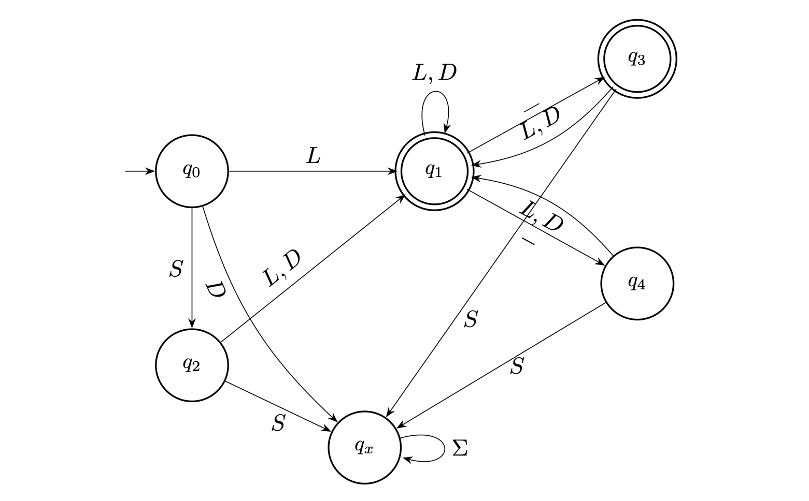

# When Regex Isn't Fast Enough

Building a custom DFA for high-traffic validation.



## Background

At work, I maintain a high-traffic service where latency matters. String validation often sits in the hot path—code that executes on every request. Regular expressions are great for most use cases, but when you need predictable performance, sometimes you need more control.

Regular expressions are a specification language for finite automata. When you write a regex, you're describing a pattern that gets compiled into a state machine. Understanding this connection means you can build that machine directly when you need more control.

## Results

Benchmarks on Apple M1 Pro show the DFA implementation is ~10-30x faster:

| Input  | regexp | DFA   | Improvement |
|--------|--------|-------|-------------|
| short  | 102 ns | 3 ns  | -97%        |
| medium | 324 ns | 23 ns | -93%        |
| long   | 741 ns | 79 ns | -89%        |

These numbers are impressive, but benchmarks should be interpreted with care. For most applications, `regexp` is fine. The DFA approach makes sense when validation is genuinely on the hot path.

## The Point

This is not an argument against regex. It's an argument for learning the fundamentals. When you understand what regex engines do under the hood, you gain the option to build something custom when the situation calls for it.

## Paper

The full write-up explaining the theory and implementation.

📄 [Download Paper (PDF)](https://nightly.link/josestg/dfaregexp/workflows/ci/main/paper.zip)

Or build locally:

```bash
make pdf
```
